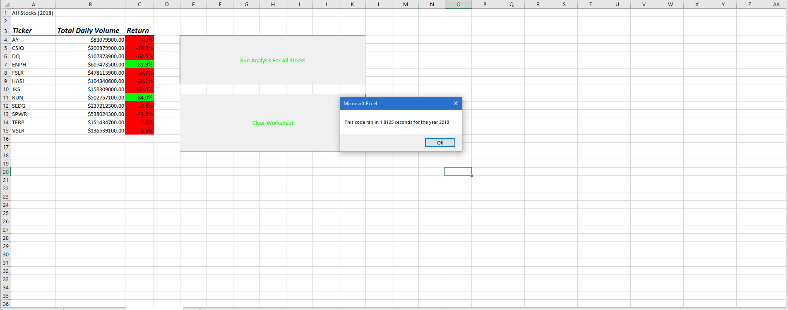

# An Analysis of All Stock Values For Selected Years 2017 and 2018
[VBA_Challenge](VBA_Challenge.zip)

## **Overview of Project**:
The main intention of this analysis is to provide a working macro or subroutine to analyze all given stock data for the given year and provide an easy-to-access table of the important values related to each group's stock performances over the course of the year in question. The initial column provides the ticker name of each stock entity and is followed by a column for both the daily volume of trades and the percentage of returns for investments, respectively. The workbook file also includes a button for easy execution of the subroutine, for which the program prompts the user to input their desired year parameter, and a second button to clear all occupied cells in the analysis worksheet for the user to re-run the subroutine for a follow-up analysis. This subroutine was then refactored to determine differences in the speed of execution between the initial construction of VBA code to run the analysis and a more streamlined format that would yield the same result.

'''

### *Purpose*
The purpose behind this re-working of the code from the initially constructed subroutine was to use Excel's timer function to have an immediately accessible value to compare how the efficiency of code can impact the time needed to execute the subroutine. The message box that the user would see after running the subroutine provides a comparable time needed to run the subroutines.

## **Results**:
The differences in time of execution between the two different file types were very clear based on the time elapsed message box that each code execution provided. Based on the initial line of code written in the file "green stocks" and the subsequent code written in the file "VBA Challenge", the time taken to process the code was nearly 7 times faster in the most recent case of running the subroutine, as seen in the images below.
'''
### *Green Stocks 2017 Analysis*

'''
### *VBA Challenge 2017 Analysis*
'''

### *Green Stocks 2018 Analysis*
'''

### "VBA Challenge 2018 Analysis*
'''

'''

## **Summary**:

