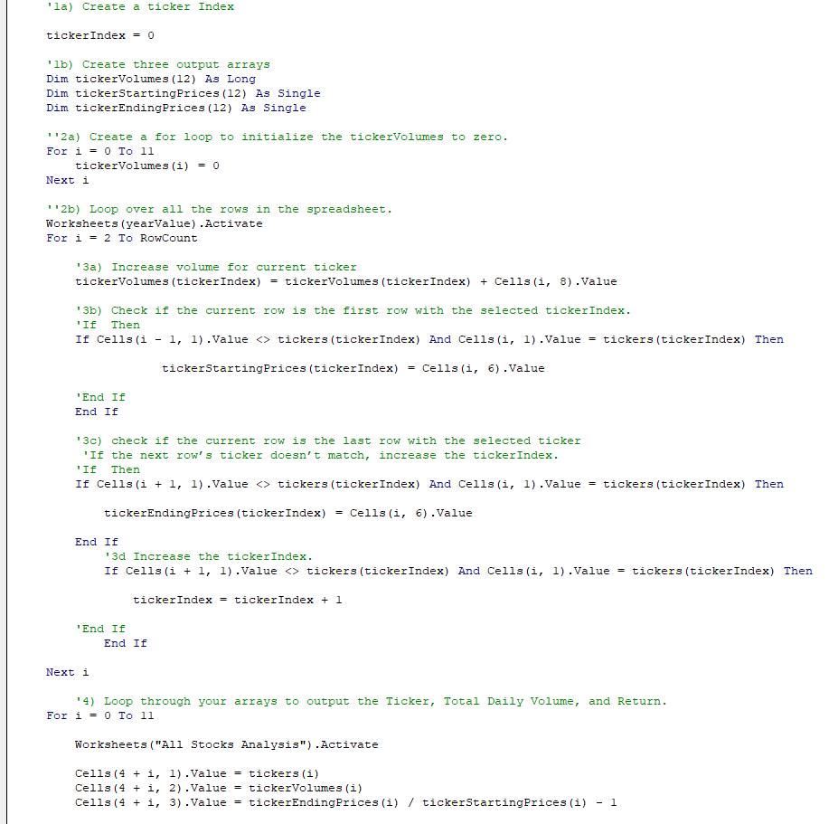

# An Analysis of All Stock Values For Selected Years 2017 and 2018
```

## [VBA_Challenge](VBA_Challenge.zip)

```
## [green_stocks](green_stocks.zip)

```

## **Overview of Project**:
The main intention of this analysis is to provide a working macro or subroutine to analyze all given stock data for the given year and provide an easy-to-access table of the important values related to each group's stock performances over the course of the year in question. The initial column provides the ticker name of each stock entity and is followed by a column for both the daily volume of trades and the percentage of returns for investments, respectively. The workbook file also includes a button for easy execution of the subroutine, for which the program prompts the user to input their desired year parameter, and a second button to clear all occupied cells in the analysis worksheet for the user to re-run the subroutine for a follow-up analysis. This subroutine was then refactored to determine differences in the speed of execution between the initial construction of VBA code to run the analysis and a more streamlined format that would yield the same result.

```

### *Purpose*
The purpose behind this re-working of the code from the initially constructed subroutine was to use Excel's timer function to have an immediately accessible value to compare how the efficiency of code can impact the time needed to execute the subroutine. The message box that the user would see after running the subroutine provides a comparable time needed to run the subroutines.

## **Results**:
The differences in time of execution between the two different file types were very clear based on the time elapsed message box that each code execution provided. Based on the initial line of code written in the file "green stocks" and the subsequent code written in the file "VBA Challenge", the time taken to process the code was nearly 7 times faster in the most recent case of running the subroutine, as seen in the images below.
```
### *Green Stocks 2017 Analysis*

```
### *VBA Challenge 2017 Analysis*

```
### *Green Stocks 2018 Analysis*

```
### *VBA Challenge 2018 Analysis*

```
The resulting differences that refactoring the code yielded are a clear indicator that efficiency greatly impacts the time and resources needed run subroutines and the reduction in time needed to run the code can be multiple times greater as the length of code needing to be run increases as well. The code blocks in the code editor are also a strong indicator of the increased efficiency refactoring code can lead to. The blocks of code to run the main section of the subroutine's calculations do not fit neatly within a single visible page in the "green stocks" file, while they are able to be viewed easily within a single page in the "VBA Challenge" file, as shown in the screenshots below.
```
### *Green Stocks Code Block*

```
### *VBA Challenge Code Block*

```
The differences that both the script user and the code author will both notice in the two different files make it clear that refactoring code to be more efficient has a drastic impact in using such subroutines.

```

## **Summary**:
### *Advantages*
The advantages of refactoring code can be clearly seen in the sections previously presented in the analysis of these stock data worksheets, and the ability to combine more operations into the same subroutines with the same amount of resources and time dedicated to running the scripts is increased when refactoring code into a more efficient format.
### *Disadvantages*
The primary disadvantages presented by refactoring code are mainly dependent on the skill of the code's author and their knowledge of the possible ways to recombine and simplify code blocks. Some of the biggest difficulties faced in the refactoring of this analysis were mainly the result of inexperience with the syntax that VBA utilizes and the lack of knowledge in how to debug common errors that arise when overlooking undefined variables that are left behind from refactoring or forgetting to add and remove important operation symbols such as brackets and parentheses.
```
### *Pros and Cons to Refactoring*
For the most part, refactoring code has few cons in the actual operation of the script once it is correctly written. The advantages of faster execution times and simpler code blocks to read are major pros to the practice and the disadvantages, as presented previously, are mostly the result of the coder's errors themselves. The only other con that could be related to refactoring code is the fact that some code may not be able to be effectively improved based on the amount of time needed to analyze and re-work it. The trade-off of time needed to understand and refactor the code and the benefits when running it that come from successful refactoring is the biggest con that could arise, but - as stated before - such a downside is mainly dependent on the experience and skill of the code's author and editor.

